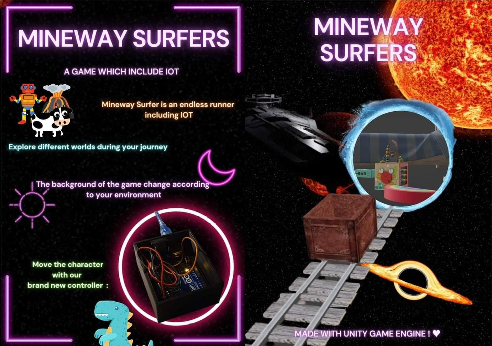
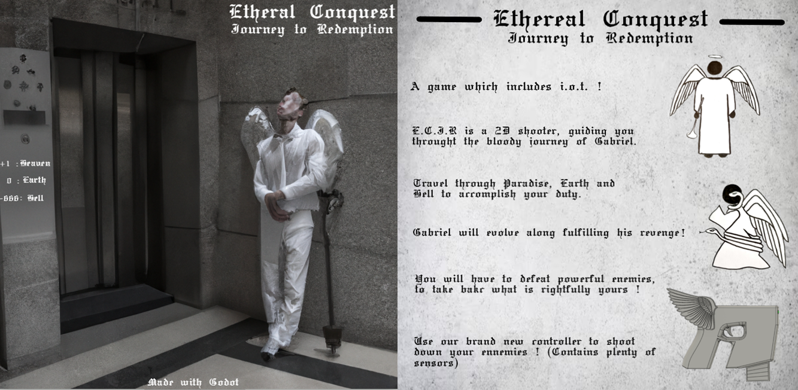
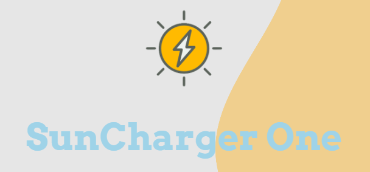
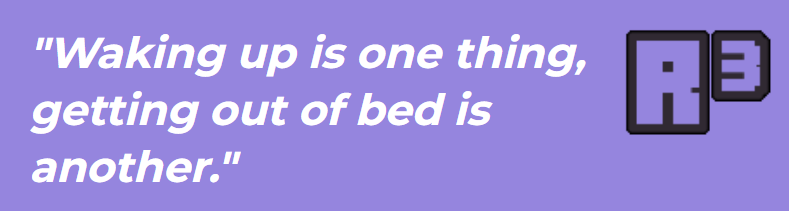

# School Projects Portfolio

Welcome to my portfolio of school projects, showcasing a variety of game development and 3D modeling and printing projects. Below you will find a brief description of each project, along with relevant presentation files and images.

## Mineway Surfer
**Platform:** Unity (Platform Game)  
**Presentation:** [Mineway Surfer Presentation (PPTX)](Mineway.pptx)

---

## Ethereal Conquest
**Platform:** Godot (Scroll Shooter Game)  
**Presentation:** [Ethereal Conquest Presentation (PPTX)](Ethereal.pdf)

---

## Suncharger One
**Platform:** Solidworks, 3D Printing  
**Design Documentation:** [Suncharger One Documentation (PDF)](link-to-pdf)

---

## R³ (Robot Reveil Roulant - Rolling Alarm Clock Robot)
**Platform:** Solidworks, 3D Printing  
**Design Documentation:** [R³ Documentation (PDF)](link-to-pdf)

---

Feel free to explore the projects and download the presentations and documentation to learn more about the design and development processes involved in each.
